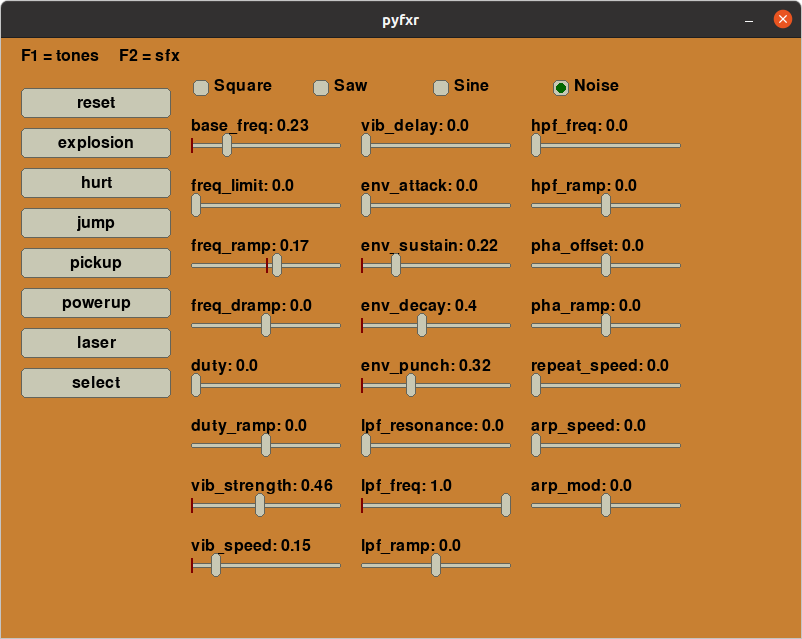

# pyfxr

Sound effects generation for Python, compatible with Pygame and Pyglet.


## Installation

`pyfxr` is on PyPI and pre-compiled for Mac, Windows and Linux. You can install
the library with

```
pip install pyfxr
```

## Documentation

[Full API documentation](https://pyfxr.readthedocs.io/)


## Pygame Usage

```
# Set mixer to 44kHz mono
pygame.mixer.pre_init(44100, channels=1)

# Generate a sound
tone = pygame.mixer.Sound(
    buffer=pyfxr.pluck(duration=1.0, pitch='A4')
)

# Play it
tone.play()
```

## Usage with Pyglet

```
# Generate a random explosion sound
explosion = pyglet.media.StaticSource(pyfxr.explosion())

# Play it
explosion.play()
```

## Usage with sounddevice

```
import sounddevice
import pyfxr

sounddevice.play(pyfxr.jump(), pyfxr.SAMPLE_RATE)
```

## GUI

A Pygame GUI is in development, to explore the feature set and create music!

To install the Pygame-based GUI along with the library, use:

```
pip install pyfxr[gui]
```

Then you can run the GUI by running `pyfxr`.



